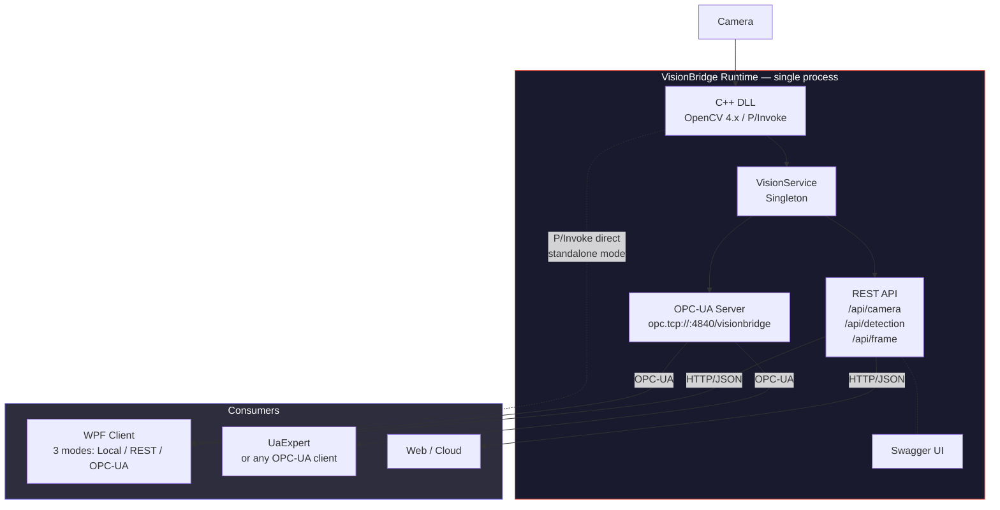

# VisionBridge

Native C++ / OpenCV vision engine with multi-protocol access — P/Invoke, REST and OPC-UA.

---

This project is part of a series of small, focused technical playgrounds I maintain as a personal portfolio.
No grand ambitions — just a concrete excuse to work with native/managed interop, real-time image processing,
industrial communication protocols, and the kind of layered architecture you find in factory vision systems.

It started as interview preparation for NeuroCheck (industrial image processing, Stuttgart).
It kept growing because the problem space turned out to be genuinely interesting.


## What this project does

A C++ DLL captures frames from a laptop camera and runs OpenCV-based detection algorithms
(color, face, edge, circle). The results are exposed through a C-compatible export interface.

On top of that, a single ASP.NET Core process — the **VisionBridge Runtime** — owns the camera
and serves the same data through two protocols simultaneously:

- **REST API** (HTTP/JSON) for web clients, dashboards, and testing via Swagger
- **OPC-UA Server** for industrial consumers (PLCs, SCADA, robots)

A **WPF desktop client** can connect to the data through three different sources:
direct P/Invoke to the DLL, HTTP to the REST API, or OPC-UA subscription.


## Architecture



**Key constraint:** the C++ DLL uses global state (`static cv::VideoCapture`), so only one process
can own the camera at a time. The Runtime is that process — REST and OPC-UA both read from the
same `VisionService` singleton in memory, with zero network overhead between them.


## Projects in this solution

### NeuroC_ComVision — C++ DLL

The vision processing engine. Runs a camera capture thread in the background and exposes
detection results through `extern "C"` exports.

| Function | What it does |
|----------|-------------|
| `StartCamera` / `StopCamera` | Camera lifecycle (dedicated `std::thread`, `std::mutex` for frame access) |
| `GetFrame` | Color detection — HSV filtering for red objects, contour extraction, bounding box |
| `DetectFaces` | Haar cascade, up to 32 simultaneous detections |
| `DetectEdges` | Canny algorithm with Gaussian pre-filtering, grayscale output |
| `DetectCircles` | Hough transform, results as bounding boxes |
| `GetFrameInfo` / `GetFrameBytesRgb` | Raw frame access (BGR native + RGB converted) with stride metadata |


### VisionBridge Runtime (REST_API_NeuroC_Prep) — ASP.NET Core 8

The central process. Owns the camera via P/Invoke and exposes data through two protocols.

**REST API** — three controller groups:

| Controller | Endpoints |
|------------|-----------|
| `CameraController` | `POST /api/camera/start`, `stop`, `GET status`, `POST cascade` |
| `DetectionController` | `GET /api/detection/color`, `faces`, `circles`, `edges` |
| `FrameController` | `GET /api/frame/info`, `rgb` (Base64), `image` (BMP download) |

**OPC-UA Server** — embedded as an `IHostedService`, shares the same `VisionService` singleton:

```
opc.tcp://localhost:4840/visionbridge

Objects/Vision
├── Camera/Running       (Boolean)
├── Color/Detected       (Boolean)
├── Color/X              (Int32)
├── Color/Y              (Int32)
├── Color/Width          (Int32)
├── Color/Height         (Int32)
├── Faces/Count          (Int32)
└── Circles/Count        (Int32)
```

Both protocols update from the same data — one camera, one singleton, two interfaces.


### VisionClientWPF — WPF Desktop Client

A test bench that can connect to vision data through three interchangeable sources,
selectable at runtime via a dropdown:

| Source | Video | Detection | Latency | Use case |
|--------|:-----:|:---------:|:-------:|----------|
| **Lokal (P/Invoke)** | 30 FPS | Full (4 modes) | ~1ms | Standalone, DLL on same machine |
| **REST API (HTTP)** | ~5 FPS (Base64) | Full (4 modes) | ~10ms | Remote access, Runtime running |
| **OPC-UA** | No video | Scalar values only | ~250ms | Industrial monitoring |

This is implemented through an `IVisionSource` abstraction — the UI code stays the same
regardless of which source is active. Each source implements `Start`, `Stop`, `GetFrameRgb`,
`DetectColor`, `DetectFaces`, `DetectCircles`, and `DetectEdges`.

Features: live video rendering (RGB24 BitmapSource), bounding box / ellipse overlays on a
Canvas layer, mode selector (Color / Face / Edge / Circle), FPS counter, status display.


### OPC-UA_ClientSimulator — WPF (planned)

A simulated industrial consumer (PLC / Robot) that will subscribe to the OPC-UA server
and react to vision data with sorting logic. Not yet implemented.


### OPC-UA_Server — Console (deprecated)

Early standalone OPC-UA server prototype. The functionality has been integrated
into the VisionBridge Runtime as an `IHostedService`. This project can be removed.


## Tech stack

| Layer | Technologies |
|-------|-------------|
| Vision engine | C++17, OpenCV 4.x, Windows DLL, `std::thread`, `std::mutex` |
| Runtime | ASP.NET Core 8, OPC Foundation .NET Standard SDK, Swagger/OpenAPI |
| Desktop client | C# / .NET 8, WPF, P/Invoke, OPC-UA Client SDK, `DispatcherTimer` |
| Interop | `extern "C"` exports, `DllImport` with `CallingConvention.Cdecl`, struct marshalling |
| Protocols | HTTP/JSON (REST), OPC-UA (Binary over TCP) |


## Project structure

```
NeuroC_ComVision/
├── NeuroC_ComVision/              # C++ DLL — OpenCV processing engine
│   ├── NeuroC_ComVision.h         # Exported C interface (structs + functions)
│   └── NeuroC_ComVision.cpp       # Capture thread, detection algorithms
│
├── REST_API_NeuroC_Prep/          # VisionBridge Runtime (REST + OPC-UA)
│   ├── Program.cs                 # Host setup — registers VisionService + OpcUaHostedService
│   ├── Interop/NativeInterop.cs   # P/Invoke declarations
│   ├── Services/VisionService.cs  # Singleton — camera lifecycle + detection logic
│   ├── Controllers/               # CameraController, DetectionController, FrameController
│   ├── Models/VisionDtos.cs       # Shared response types
│   └── OpcUa/                     # Embedded OPC-UA server
│       ├── VisionNodeManager.cs   # Node tree creation + 250ms polling loop
│       ├── VisionOpcUaServer.cs   # StandardServer subclass
│       └── OpcUaHostedService.cs  # IHostedService bootstrap
│
├── VisionClientWPF/               # WPF desktop client (multi-source)
│   ├── MainWindow.xaml / .cs      # UI + rendering loop
│   ├── VisionInterop.cs           # P/Invoke declarations (for local mode)
│   └── Sources/                   # Data source abstraction
│       ├── IVisionSource.cs       # Interface + shared result types
│       ├── LocalVisionSource.cs   # P/Invoke direct
│       ├── RestVisionSource.cs    # HttpClient to REST API
│       └── OpcUaVisionSource.cs   # OPC-UA Session.Read
│
├── OPC-UA_ClientSimulator/        # PLC/Robot simulator (planned)
└── OPC-UA_Server/                 # Deprecated — integrated into Runtime
```


## How to run

**Standalone (WPF only):**
Start `VisionClientWPF` with source set to "Lokal (P/Invoke)". Requires the DLL in the output directory.

**Full stack:**
1. Start `REST_API_NeuroC_Prep` — this launches both the REST API and the OPC-UA server
2. Open Swagger at `https://localhost:7158/swagger` — call `POST /api/camera/start`
3. Start `VisionClientWPF` with source set to "REST API" or "OPC-UA"
4. Optionally connect UaExpert to `opc.tcp://localhost:4840/visionbridge`


## What I practiced building this

- Native/managed memory boundaries and struct alignment across C++ and C#
- Thread safety across a DLL boundary (global state, single camera constraint)
- Real-time frame rendering in WPF without blocking the UI thread
- Embedding an OPC-UA server inside an ASP.NET Core process as an `IHostedService`
- Protocol abstraction — same UI consuming P/Invoke, HTTP, and OPC-UA through one interface
- Designing a REST layer on top of hardware-bound resources (one camera = one singleton)
- Understanding why industrial systems use OPC-UA and REST together, not instead of each other


## Disclaimer

This is a portfolio exercise, not a production system.
The code is intentionally kept straightforward.
If you are looking for an industrial-grade vision framework, this is not it.


## Author

**Patrick Djimgou** — Germany

Part of a personal technical portfolio.


