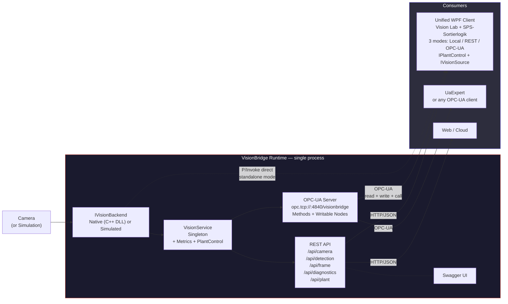

# VisionBridge

C++ / OpenCV vision engine bridged to C# via P/Invoke, with REST and OPC-UA on top.

I built this as a small technical playground for my portfolio. I originally started it while preparing
for an interview at NeuroCheck (industrial image processing, Stuttgart) and it just kind of kept going
because the problem space is genuinly fun to work with.

The idea is pretty simple: a C++ DLL grabs frames from the laptop camera, runs OpenCV detection on them,
and exports everything through a flat C interface. Then on the C# side I have multiple consumers that talk
to this DLL through different channels. It simulates, on a small scale, the architecture you'd find
in real industrial vision systems: fast native core, managed layer on top, multiple protocols.


## What it does

The C++ DLL does the heavy lifting: camera capture on a background thread, color filtering (HSV for red objects),
face detection (Haar cascade), edge detection (Canny), circle detection (Hough transform). Everything
mutex-protected, results exposed via `extern "C"` functions.

On the C# side there's a single ASP.NET Core process that I call the **VisionBridge Runtime**. It owns
the camera through P/Invoke and exposes the data through two protocols at once:

1. A **REST API** with Swagger for web clients and manual testing
2. A **bidirectional OPC-UA Server** for industrial consumers (think PLCs, SCADA, robot controllers)

Both protocols read from the same `VisionService` singleton in memory, so there's no serialization
overhead between them. One process, one camera, two interfaces.

Every detection now carries an **Inspection ID**, a **UTC timestamp**, and a **confidence score** (0–1),
providing the traceability that industrial QC systems require.

The Runtime also exposes **plant control** nodes (conveyor speed, inspection toggle, reject gate)
that OPC-UA clients can **write** to, plus OPC-UA **Methods** to start/stop the camera remotely.
A **diagnostics** endpoint (REST + OPC-UA) reports uptime, FPS, backend mode, and inspection counters.

There's a **unified WPF client** that merges the vision lab and the PLC/sorting simulator into a
single two-column interface. The left panel shows live video with bounding-box overlays (when the source
supports it), while the right panel displays detection values, plant controls, and sorting decisions.
You pick one of three data sources at runtime — direct P/Invoke to the DLL (fastest, ~30 fps), HTTP
to the REST API (~5 fps with Base64 frames), or OPC-UA (no video, just scalar values). All three are
abstracted behind an `IVisionSource` interface. An optional `IPlantControl` interface lets the OPC-UA
and REST sources write back to the server (conveyor speed, inspection toggle, reject gate, camera
start/stop), turning the demo into a full bidirectional industrial loop from a single window.


## Architecture



One thing worth noting: the DLL uses global state (`static cv::VideoCapture cap`), so only one
process can hold the camera. That's why everything goes through the Runtime. If you try to run the
WPF client in local mode while the Runtime is also running, one of them won't get the camera.


## The projects

### NeuroC_ComVision (C++ DLL)

Camera capture on a dedicated thread with `std::mutex` for frame access. The exported functions:

| Function | Description |
|----------|-------------|
| `StartCamera` / `StopCamera` | Opens/releases the webcam, starts/stops the capture thread |
| `GetFrame` | HSV color filtering for red objects, returns bounding box |
| `DetectFaces` | Haar cascade (`haarcascade_frontalface_default.xml`), up to 32 faces |
| `DetectEdges` | Gaussian blur + Canny, outputs single-channel grayscale |
| `DetectCircles` | Hough transform, results packed as bounding boxes |
| `GetFrameInfo` / `GetFrameBytesRgb` | Raw frame data with stride info, BGR or RGB |


### VisionBridge Runtime (REST_API_NeuroC_Prep)

This is the central process. ASP.NET Core 8, owns the camera via P/Invoke.

The REST API has five controller groups:

| Controller | Endpoints |
|------------|-----------|
| `CameraController` | `POST start`, `stop`, `GET status`, `POST cascade` |
| `DetectionController` | `GET color`, `faces`, `circles`, `edges` (all with InspectionId, Timestamp, Confidence) |
| `FrameController` | `GET info`, `rgb` (Base64), `image` (BMP download) |
| `PlantController` | `GET` state, `POST conveyor-speed`, `inspection`, `reject-gate` |
| `DiagnosticsController` | `GET` full diagnostics, `GET health` |

The OPC-UA server runs as an `IHostedService` in the same process. It polls the `VisionService`
every 250ms and exposes the results as OPC-UA nodes:

```
opc.tcp://localhost:4840/visionbridge

Objects/Vision
├── Camera/
│   ├── Running              (Boolean, read)
│   ├── Start()              (Method — starts the camera)
│   └── Stop()               (Method — stops the camera)
├── Color/
│   ├── Detected             (Boolean)
│   ├── X / Y / Width / Height (Int32)
│   ├── Confidence           (Double)
│   └── Timestamp            (DateTime)
├── Faces/
│   ├── Count                (Int32)
│   └── Confidence           (Double)
├── Circles/
│   ├── Count                (Int32)
│   └── Confidence           (Double)
├── Control/                          ← WRITABLE by OPC-UA clients
│   ├── ConveyorSpeed        (Double, r/w — 0–5 m/s)
│   ├── InspectionEnabled    (Boolean, r/w)
│   └── RejectGateOpen       (Boolean, r/w)
└── Diagnostics/
    ├── Uptime               (String)
    ├── BackendMode           (String — "Native" or "Simulated")
    ├── TotalInspections     (Int64)
    └── CurrentFps           (Double)
```


### Unified WPF Client (OPC-UA_ClientSimulator)

This project merges the former **VisionClientWPF** (vision lab / video rendering) and the
**OPC-UA Client Simulator** (PLC sorting logic) into a single two-column WPF application.

**Layout:**

| Area | Content |
|------|--------|
| **Left panel** — Vision Lab | Live video + overlay canvas (bounding boxes, ellipses), detection mode selector (Color / Face / Edge / Circle), FPS counter |
| **Right panel** — SPS / Steuerung | Detection values (camera status, color, faces, circles with confidence), plant control (conveyor speed, inspection, reject gate), current sorting decision + statistics |
| **Bottom bar** | Runtime diagnostics (uptime, backend, server FPS, inspections) + sorting log |

**Data sources** — pick one from the dropdown and hit Start:

| Source | Video | Detection | Plant Control | Diagnostics | Latency |
|--------|:-----:|:---------:|:-------------:|:-----------:|:-------:|
| Lokal (P/Invoke) | 30 FPS | All 4 modes | — | — | ~1ms |
| REST API (HTTP) | ~5 FPS | All 4 modes | ✅ via REST | ✅ | ~10ms |
| OPC-UA | — | Scalar values | ✅ via Write + Methods | ✅ | ~250ms |

All three sources implement `IVisionSource`. Sources that support bidirectional control also
implement `IPlantControl` — the plant control panel and camera start/stop buttons appear
automatically when the active source supports it.

**`IPlantControl` capabilities (OPC-UA + REST):**

| Feature | OPC-UA | REST |
|---------|--------|------|
| Start/Stop camera | Method call (`Camera.Start()` / `Camera.Stop()`) | `POST /api/camera/start\|stop` |
| Set conveyor speed | Write to `Control/ConveyorSpeed` | `POST /api/plant/conveyor-speed` |
| Toggle inspection | Write to `Control/InspectionEnabled` | `POST /api/plant/inspection` |
| Reject gate control | Write to `Control/RejectGateOpen` | `POST /api/plant/reject-gate` |

**Sorting logic** — runs on every source (not just OPC-UA), throttled to ~2 Hz for fast sources:

| Condition | Action |
|---|---|
| `Faces.Count > 0` | 🛑 **HALT** — safety stop |
| `Color.Detected` + `Confidence > 30%` | ⚠ **REJECT** — sort out + auto-open reject gate |
| `Circles.Count ≥ 3` | ✅ **QUALITY OK** — pass through |

When a defect is detected, the reject gate opens automatically via `IPlantControl`
and closes again when the defect clears.


### OPC-UA_Server (deprecated)

Was an early standalone console app for the OPC-UA server. Everything got folded into the Runtime
as a hosted service, so this project is basically dead code at this point.


## Tech stack

| Layer | What |
|-------|------|
| Vision engine | C++17, OpenCV 4.x, Windows DLL (`__declspec(dllexport)`), `std::thread` / `std::mutex` |
| Runtime | ASP.NET Core 8, OPC Foundation .NET Standard SDK, Swagger |
| Unified WPF client | .NET 8, WPF, P/Invoke, OPC-UA Client SDK, `DispatcherTimer`, `IVisionSource` / `IPlantControl` |
| Interop | `extern "C"`, `DllImport` with `CallingConvention.Cdecl`, manual struct marshalling |
| Protocols | HTTP/JSON, OPC-UA binary over TCP (read + write + method calls) |


## Project structure

```
NeuroC_ComVision/
├── NeuroC_ComVision/              # C++ DLL
│   ├── NeuroC_ComVision.h         # C export interface
│   └── NeuroC_ComVision.cpp       # Capture thread + detection algorithms
│
├── REST_API_NeuroC_Prep/          # VisionBridge Runtime
│   ├── Program.cs                 # Registers VisionService + OpcUaHostedService
│   ├── Interop/
│   │   ├── IVisionBackend.cs      # Abstraction over native/simulated engine
│   │   ├── NativeVisionBackend.cs # Wraps P/Invoke calls to the C++ DLL
│   │   ├── SimulatedVisionBackend.cs # Synthetic data (no DLL/camera needed)
│   │   └── NativeInterop.cs      # P/Invoke declarations
│   ├── Services/VisionService.cs  # Singleton — vision + metrics + plant control
│   ├── Controllers/
│   │   ├── CameraController.cs    # Start, Stop, Status, Cascade
│   │   ├── DetectionController.cs # Color, Faces, Circles, Edges
│   │   ├── FrameController.cs     # Frame info, RGB, BMP image
│   │   ├── PlantController.cs     # Conveyor speed, Inspection, Reject gate
│   │   └── DiagnosticsController.cs # Health check + runtime metrics
│   ├── Models/VisionDtos.cs       # DTOs (with Timestamp, Confidence, PlantControl, Diagnostics)
│   └── OpcUa/
│       ├── VisionNodeManager.cs   # OPC-UA node tree + Methods + Write callbacks + polling
│       ├── VisionOpcUaServer.cs
│       └── OpcUaHostedService.cs
│
├── OPC-UA_ClientSimulator/        # Unified WPF Client (Vision Lab + SPS-Sortierlogik)
│   ├── MainWindow.xaml            # Two-column layout: video + controls
│   ├── MainWindow.xaml.cs         # Unified logic: rendering + detection + sorting
│   ├── VisionInterop.cs           # P/Invoke for local mode
│   └── Sources/
│       ├── IVisionSource.cs       # IVisionSource + IPlantControl interfaces + result types
│       ├── LocalVisionSource.cs   # P/Invoke (video + detection, no plant control)
│       ├── RestVisionSource.cs    # HTTP + IPlantControl via REST
│       └── OpcUaVisionSource.cs   # OPC-UA + IPlantControl via Write/Methods
│
└── OPC-UA_Server/                 # Deprecated
```


## Running it

**Simulation mode (no camera or DLL needed):**
Set `"VisionBridge:Simulation": true` in `appsettings.json` (or pass `--VisionBridge:Simulation=true`
on the command line), then start `REST_API_NeuroC_Prep`. The API generates synthetic detection data —
a red object moving on a simulated conveyor belt, cycling face/circle counts. All endpoints work
identically to the real camera mode. This is the easiest way to explore the project without any hardware.

**Just the local camera (no server needed):**
Start `OPC-UA_ClientSimulator`, pick "Lokal (P/Invoke)" and click Start.
You need the DLL in the output directory. Video + detection + sorting logic work standalone.

**The full industrial loop:**
1. Start `REST_API_NeuroC_Prep` (launches REST API + OPC-UA server in one process)
2. Start `OPC-UA_ClientSimulator`
3. Pick "OPC-UA" (or "REST API") from the source dropdown and click **▶ Start**
4. The plant control panel appears automatically — adjust conveyor speed, toggle inspection
5. Use the **▶ Kamera / ■ Kamera** buttons to start/stop the camera remotely
6. Watch sorting decisions + confidence scores in real time on the right panel
7. Observe the reject gate auto-opening when a red defect is detected
8. Switch to "REST API" to see live video *and* plant control at the same time
9. Or connect UaExpert to `opc.tcp://localhost:4840/visionbridge` to browse all nodes
10. Try `GET /api/diagnostics` or `GET /api/plant` in Swagger

**New REST endpoints to try:**
- `GET /api/diagnostics` — uptime, backend mode, FPS, inspection count, plant state, last detection
- `GET /api/diagnostics/health` — simple health check
- `GET /api/plant` — current conveyor speed, inspection toggle, reject gate
- `POST /api/plant/conveyor-speed?speed=2.5` — set conveyor speed
- `POST /api/plant/inspection?enabled=false` — disable inspection
- `POST /api/plant/reject-gate?open=true` — open reject gate


## What I got out of this

This project gave me a chance to actually deal with stuff that's hard to learn from docs alone.
Debugging struct alignment mismatches between C++ and C# at runtime is a very different experience
than reading about `StructLayout` on MSDN. Same with threading across a DLL boundary, or figuring
out how to render 30fps video in WPF without starving the dispatcher.

Some of the things I worked through:

* Struct layout and memory alignment across native/managed boundaries
* Mutex-protected global state in a DLL consumed by multiple managed threads
* WPF rendering pipeline and how `DispatcherTimer` + `BitmapSource.Freeze()` interact
* Embedding OPC-UA inside an ASP.NET Core process as an `IHostedService`
* Why industrial systems typically run OPC-UA and REST side by side (not one or the other)
* Abstracting over three completely different data sources behind one interface
* Separating read-only data (`IVisionSource`) from actuator commands (`IPlantControl`) with
  optional interface implementation — the UI adapts automatically to the source's capabilities
* Dependency injection of hardware backends (`IVisionBackend`) for testability without physical devices
* Merging two WPF apps into one coherent HMI that works in all three modes, with the plant
  control panel appearing only when the active source supports it
* Simulating a PLC sorting loop that consumes detection data and makes real-time decisions,
  regardless of whether the data comes from P/Invoke, REST, or OPC-UA
* **Bidirectional OPC-UA**: writable nodes (`OnSimpleWriteValue` callbacks), OPC-UA Methods, and
  how a PLC client can both read detection data and write control commands back to the server
* **Industrial traceability**: adding inspection IDs, timestamps, and confidence scores to every detection
* **Runtime observability**: health checks, FPS tracking, uptime, inspection counters — the kind of
  diagnostics you'd expect in any production vision system

Nothing groundbreaking. Just the kind of practice that sticks.


## Disclaimer

This is a portfolio project, not production code. I kept things straightforward on purpose.
Don't expect industrial-grade anything here.


## Author

Patrick Djimgou


