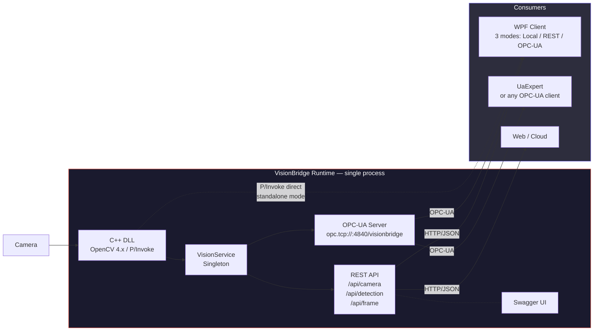

# VisionBridge

C++ / OpenCV vision engine bridged to C# via P/Invoke, with REST and OPC-UA on top.

I built this as a small technical playground for my portfolio. I originally started it while preparing
for an interview at NeuroCheck (industrial image processing, Stuttgart) and it just kind of kept going
because the problem space is genuinly fun to work with.

The idea is pretty simple: a C++ DLL grabs frames from the laptop camera, runs OpenCV detection on them,
and exports everything through a flat C interface. Then on the C# side I have multiple consumers that talk
to this DLL through different channels. It simulates, on a small scale, the architecture you'd find
in real industrial vision systems: fast native core, managed layer on top, multiple protocols.


## What it does

The C++ DLL does the heavy lifting: camera capture on a background thread, color filtering (HSV for red objects),
face detection (Haar cascade), edge detection (Canny), circle detection (Hough transform). Everything
mutex-protected, results exposed via `extern "C"` functions.

On the C# side there's a single ASP.NET Core process that I call the **VisionBridge Runtime**. It owns
the camera through P/Invoke and exposes the data through two protocols at once:

1. A **REST API** with Swagger for web clients and manual testing
2. An **OPC-UA Server** for industrial consumers (think PLCs, SCADA, robot controllers)

Both protocols read from the same `VisionService` singleton in memory, so there's no serialization
overhead between them. One process, one camera, two interfaces.

There's also a **WPF client** that can switch between three data sources at runtime: direct P/Invoke
to the DLL (fastest, ~30fps), HTTP to the REST API (~5fps with Base64 frames), or OPC-UA
(no video, just scalar detection values). Same UI code for all three, abstracted behind an `IVisionSource` interface.


## Architecture



One thing worth noting: the DLL uses global state (`static cv::VideoCapture cap`), so only one
process can hold the camera. That's why everything goes through the Runtime. If you try to run the
WPF client in local mode while the Runtime is also running, one of them won't get the camera.


## The projects

### NeuroC_ComVision (C++ DLL)

Camera capture on a dedicated thread with `std::mutex` for frame access. The exported functions:

| Function | Description |
|----------|-------------|
| `StartCamera` / `StopCamera` | Opens/releases the webcam, starts/stops the capture thread |
| `GetFrame` | HSV color filtering for red objects, returns bounding box |
| `DetectFaces` | Haar cascade (`haarcascade_frontalface_default.xml`), up to 32 faces |
| `DetectEdges` | Gaussian blur + Canny, outputs single-channel grayscale |
| `DetectCircles` | Hough transform, results packed as bounding boxes |
| `GetFrameInfo` / `GetFrameBytesRgb` | Raw frame data with stride info, BGR or RGB |


### VisionBridge Runtime (REST_API_NeuroC_Prep)

This is the central process. ASP.NET Core 8, owns the camera via P/Invoke.

The REST API has three controller groups:

| Controller | Endpoints |
|------------|-----------|
| `CameraController` | `POST start`, `stop`, `GET status`, `POST cascade` |
| `DetectionController` | `GET color`, `faces`, `circles`, `edges` |
| `FrameController` | `GET info`, `rgb` (Base64), `image` (BMP download) |

The OPC-UA server runs as an `IHostedService` in the same process. It polls the `VisionService`
every 250ms and exposes the results as OPC-UA nodes:

```
opc.tcp://localhost:4840/visionbridge

Objects/Vision
├── Camera/Running       (Boolean)
├── Color/Detected       (Boolean)
├── Color/X              (Int32)
├── Color/Y              (Int32)
├── Color/Width          (Int32)
├── Color/Height         (Int32)
├── Faces/Count          (Int32)
└── Circles/Count        (Int32)
```


### VisionClientWPF

The WPF desktop client. You pick a data source from a dropdown and hit Start:

| Source | Video | Detection | Latency | When to use |
|--------|:-----:|:---------:|:-------:|-------------|
| Lokal (P/Invoke) | 30 FPS | All 4 modes | ~1ms | DLL on same machine, no server needed |
| REST API | ~5 FPS | All 4 modes | ~10ms | Runtime is running somewhere |
| OPC-UA | None | Scalar values | ~250ms | Industrial monitoring scenario |

The three sources implement an `IVisionSource` interface so the MainWindow code doesn't care
which one is active. It just calls `DetectColor()`, `GetFrameRgb()` etc. and renders whatever comes back.

The UI renders frames as `BitmapSource` (RGB24), draws bounding boxes and ellipses on a Canvas overlay,
and shows FPS + detection results in a sidebar.


### OPC-UA_ClientSimulator (planned)

Will be a WPF app that simulates a PLC or robot controller. Subscribes to the OPC-UA nodes
and makes sorting decisions based on detection results. Haven't gotten to it yet.


### OPC-UA_Server (deprecated)

Was an early standalone console app for the OPC-UA server. Everything got folded into the Runtime
as a hosted service, so this project is basically dead code at this point.


## Tech stack

| Layer | What |
|-------|------|
| Vision engine | C++17, OpenCV 4.x, Windows DLL (`__declspec(dllexport)`), `std::thread` / `std::mutex` |
| Runtime | ASP.NET Core 8, OPC Foundation .NET Standard SDK, Swagger |
| WPF client | .NET 8, WPF, P/Invoke, OPC-UA Client SDK, `DispatcherTimer` |
| Interop | `extern "C"`, `DllImport` with `CallingConvention.Cdecl`, manual struct marshalling |
| Protocols | HTTP/JSON, OPC-UA binary over TCP |


## Project structure

```
NeuroC_ComVision/
├── NeuroC_ComVision/              # C++ DLL
│   ├── NeuroC_ComVision.h         # C export interface
│   └── NeuroC_ComVision.cpp       # Capture thread + detection algorithms
│
├── REST_API_NeuroC_Prep/          # VisionBridge Runtime
│   ├── Program.cs                 # Registers VisionService + OpcUaHostedService
│   ├── Interop/NativeInterop.cs
│   ├── Services/VisionService.cs  # The singleton that wraps all native calls
│   ├── Controllers/               # Camera, Detection, Frame
│   ├── Models/VisionDtos.cs
│   └── OpcUa/
│       ├── VisionNodeManager.cs   # OPC-UA node tree + polling
│       ├── VisionOpcUaServer.cs
│       └── OpcUaHostedService.cs
│
├── VisionClientWPF/               # Desktop client
│   ├── MainWindow.xaml / .cs
│   ├── VisionInterop.cs           # P/Invoke (for local mode)
│   └── Sources/
│       ├── IVisionSource.cs       # Interface + result types
│       ├── LocalVisionSource.cs   # P/Invoke
│       ├── RestVisionSource.cs    # HTTP
│       └── OpcUaVisionSource.cs   # OPC-UA
│
├── OPC-UA_ClientSimulator/        # Planned
└── OPC-UA_Server/                 # Deprecated
```


## Running it

**Just the WPF client:**
Set the source to "Lokal (P/Invoke)" and click Start. You need the DLL in the output directory.

**The full thing:**
1. Start `REST_API_NeuroC_Prep` (launches REST API + OPC-UA server in one process)
2. Go to `https://localhost:7158/swagger` and call `POST /api/camera/start`
3. Start `VisionClientWPF`, pick "REST API" or "OPC-UA" as source
4. Or connect UaExpert to `opc.tcp://localhost:4840/visionbridge` to browse the nodes


## What I got out of this

This project gave me a chance to actually deal with stuff that's hard to learn from docs alone.
Debugging struct alignment mismatches between C++ and C# at runtime is a very different experience
than reading about `StructLayout` on MSDN. Same with threading across a DLL boundary, or figuring
out how to render 30fps video in WPF without starving the dispatcher.

Some of the things I worked through:

* Struct layout and memory alignment across native/managed boundaries
* Mutex-protected global state in a DLL consumed by multiple managed threads
* WPF rendering pipeline and how `DispatcherTimer` + `BitmapSource.Freeze()` interact
* Embedding OPC-UA inside an ASP.NET Core process as an `IHostedService`
* Why industrial systems typically run OPC-UA and REST side by side (not one or the other)
* Abstracting over three completely different data sources behind one interface

Nothing groundbreaking. Just the kind of practice that sticks.


## Disclaimer

This is a portfolio project, not production code. I kept things straightforward on purpose.
Don't expect industrial-grade anything here.


## Author

Patrick Djimgou


